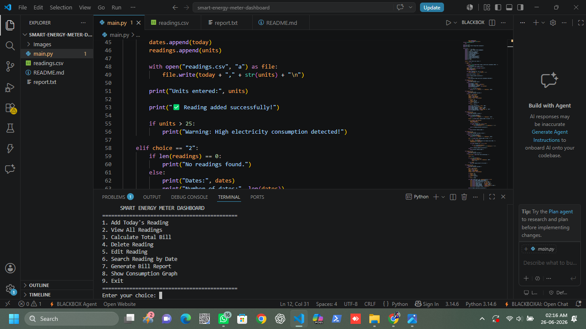
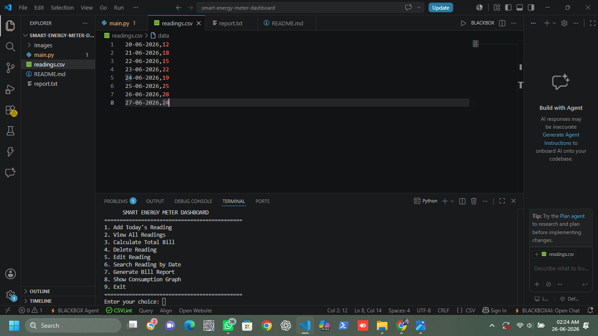
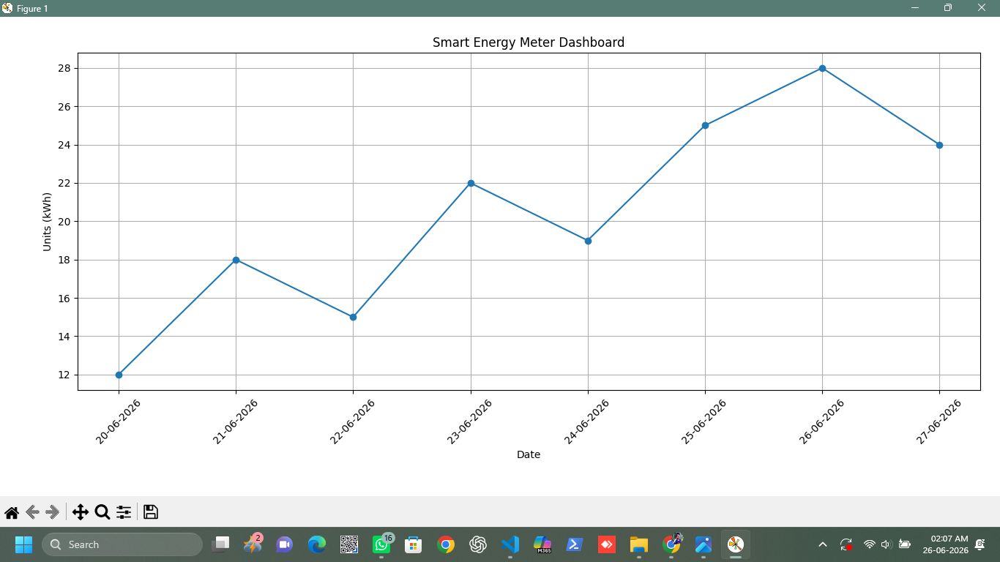
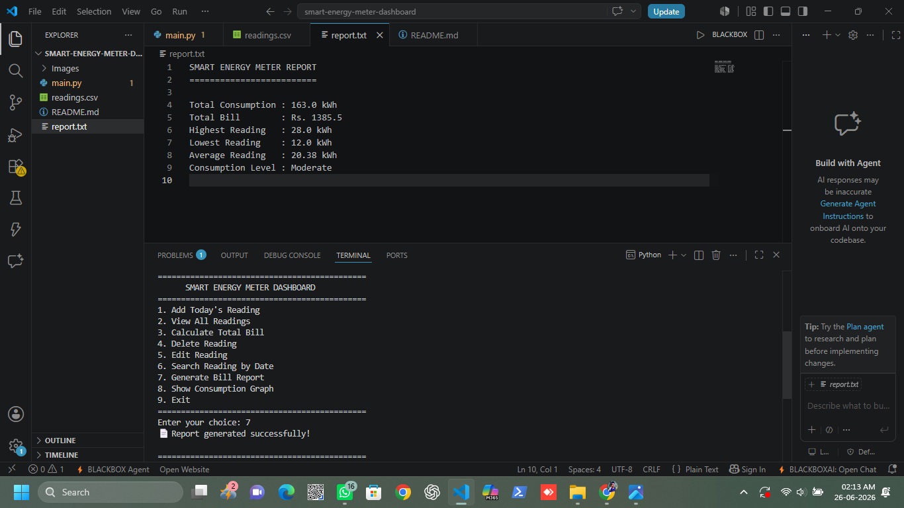

# ⚡ Smart Energy Meter Dashboard

A Python-based application to record, manage, and analyze daily electricity consumption.

---

## 📖 Overview

The Smart Energy Meter Dashboard helps users store electricity readings, calculate bills, generate reports, search, edit and delete readings, and visualize electricity usage using graphs.

---

## ✨ Features

- ➕ Add Today's Reading
- 📋 View All Readings
- 💰 Calculate Total Bill
- 🗑️ Delete Reading
- ✏️ Edit Reading
- 🔍 Search Reading by Date
- 📄 Generate Bill Report (report.txt)
- 📈 Show Consumption Graph
- 💾 Store data permanently using CSV files

---

## 🛠 Technologies Used

- Python 3
- CSV File Handling
- Matplotlib
- VS Code

---

## 📂 Project Structure

```
smart-energy-meter-dashboard/
│
├── main.py
├── readings.csv
├── report.txt
└── README.md
```

---

## ▶️ How to Run

1. Install Python 3.
2. Install Matplotlib

```bash
pip install matplotlib
```

3. Run the program

```bash
python main.py
```

---

## 📊 Sample Output

The program allows you to:

- Add electricity readings
- View all saved readings
- Calculate electricity bill
- Generate a bill report
- Display electricity consumption graph

---

## 🚀 Future Improvements

- Monthly electricity report
- Yearly electricity analysis
- PDF report generation
- User login system
- GUI version using Tkinter

---

## Screenshots

### Main Menu


### View All Readings


### Consumption Graph


### Generated Report


## 👨‍💻 Developed By

**Nitin Krishna**

B.E. Electrical and Electronics Engineering (EEE)
